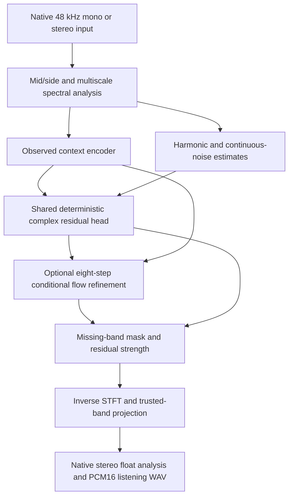

# Current model and next controlled extensions

Status: 2026-10-05. This describes the **implemented native scene v2**, the latest
48 kHz stereo listening delivery. Older v0 and flow-v1 models remain available
and have different architectures. Exact run evidence is in
[SCENE_V2_RESULTS.md](SCENE_V2_RESULTS.md); citations and adaptation scope are in
[REFERENCES.md](REFERENCES.md). Nothing below implies recovered original content.

## Signal path

The supplied cutoff/transition describe what is trusted and what may be added.
There is no automatic damage classifier. A controlled test first low-passes an
available reference and scores reconstruction against that reference. Direct
restoration instead accepts an assumed cutoff and has no clean-reference score.
Restoration reads bounded regions of up to 12 seconds; whole-song streaming and
seam handling are not implemented yet. This is an offline, noncausal model.

Stereo is converted to orthonormal mid/side: `M=(L+R)/sqrt(2)` and
`S=(L-R)/sqrt(2)`. Both channels use shared weights. Each sees its own complex
spectrum plus channel identity and relative M/S scale; there is no full joint
stereo-attention or dedicated spatial head. A silent side remains silent, so mono
is not presented as reconstructed width.

The main STFT has FFT 1024, hop 256, square-root Hann windows and normalized
overlap-add: 513 positive-frequency bins, a 21.33 ms window and a 5.33 ms hop.
FFT 256 and 4096 analyses supply fine/coarse summaries, and the same three FFT
sizes supervise synthesized-waveform training. These sizes trade time resolution
against frequency resolution. A clip-level scale estimated solely from degraded
input normalizes each M/S channel; quiet scales have a small floor.

## Two small networks, sharing across coordinates

Each stage has **106,342 parameters**, not one huge network for every bin:

| Component | Layers | Parameters | How often evaluated |
|---|---|---:|---|
| Context encoder | 3098 → 32 tanh → 32 linear | 100,224 | Once per frame and active M/S channel |
| Shared frequency head | 184 → 32 tanh → 6 linear | 6,118 | Each untrusted frequency/frame coordinate |

The deterministic and flow checkpoints have separate weights, so using both
requires **212,684 parameters**. The optional song adapter adds 64. Raw f32 model
weights are about 0.41 MiB per stage; activations, spectra, features and caches
dominate working memory. This is explicit Rust backpropagation, not a transformer,
U-Net, convolution stack or general autograd framework.

The encoder's 3098 inputs are full complex observed spectra at offsets −4, 0,
+4 hops (`3*513*2=3078` scalars), sixteen fine/coarse energy
summaries, and four metadata values. Coefficients above the trusted cutoff are
zeroed in these encoder features. Output is a 32-value context embedding.

The head's 184 inputs combine that embedding, 110 low-spectrum values routed
through ratios 1/2/3/4/6 at eleven offsets from −16 to +16 hops, four harmonic/
noise-prior components, eighteen current-state neighborhood components (3×3
complex values), four flow-time values, and sixteen coordinate/scale/channel/
onset metadata values. The ±16-hop observed context spans about 171 ms in total.
Neighbor-state input gives the flow local coupling over time and frequency.
Parameter sharing allows the same small head to address different frequencies,
cutoffs and times, rather than learning a separate output weight set for each.

## What the initial estimate generates

The DSP harmonic estimate searches input peaks near output frequency divided by
2, 3, 4 and 6, uses neighboring-frame phase to refine their frequency alignment,
and extends a sine-family phase relationship. This is a heuristic for linked
partials, not reliable pitch/source separation for every polyphonic signal.
The noise estimate starts from a continuous seeded waveform, takes its STFT and
shapes it with an input-derived, non-rising spectral envelope. It is temporally
consistent excitation rather than independent random phase at every bin.
This hybrid motivation is related to
[Engel et al., DDSP](https://arxiv.org/abs/2001.04643), without its architecture.

For head outputs `y0..y5`, deterministic completion is

`z = 2*sigmoid(y4)*H + 2*sigmoid(y5)*N + (y0 + i*y1)`.

Thus the network can scale harmonic/noise components and add a complex residual
that changes both amplitude and phase. Output layers start at zero: initially
the harmonic and noise gains are one and the extra residual is zero. Outputs
`y2,y3` have no role in deterministic mode. Phase is learned through complex
residuals, not Griffin–Lim or target phase supplied at inference.

## What Flow2 changes

Flow2 starts from the frozen deterministic stage's estimate, not pure white
noise. That estimate contains the seeded noise component, so seed changes can
alter the initial state. During training, `z0` is this estimate and `z1` the
synthetic target complex residual. At a sampled artificial path time `tau`,

`z_tau = (1-tau)*z0 + tau*z1`, with target velocity `u = z1-z0`.

The flow head predicts

`v_re = y0 + y2*z_re`, `v_im = y1 + y3*z_im`.

The direct diagonal terms provide local expansion/contraction of the state;
the other outputs depend on the context and neighboring state, allowing more
than independent affine updates. These latent coefficients are **not** evidence
of restored waveform microdynamics or a dedicated expander. Outputs `y4,y5`
are unused in flow mode. The probability-path regression is adapted from
[Lipman et al., Flow Matching](https://arxiv.org/abs/2210.02747), with informative
initialization motivated by [Yun et al., FLowHigh](https://arxiv.org/abs/2501.04926).

At inference, eight Euler updates `z += v(z,tau)/8` run from tau=0 toward tau=1.
There is no fresh random injection at each step. **Song time and flow time are
different axes**: tau is refinement progress over a whole time-frequency field.
This is not a trained diffusion/score sampler, an optimal-transport solver,
reflow or a calibrated probability/density model. A small terminal waveform
auxiliary modifies the pure flow-matching objective. Nonfinite or magnitude-64
states fail visibly instead of silently clipping targets.

Only the missing residual is synthesized with a smooth transition mask and a
user strength. The original signal is retained. A whole-region Fourier
projection then replaces trusted low frequencies with the input's coefficients.
Float outputs retain known bands to about 1e-7 relative error; PCM16 listening
copies incur quantization. Local STFT coefficients near the cutoff can still
change through window leakage. Strength zero and declared wholly trusted input
are exact identity paths. None of these contracts certifies the invented highs.

## What we actually trained

Native v2 trained 600 deterministic updates followed by 600 flow updates over
the same 150 independently seeded two-second procedural scenes. Each scene
supplied four randomly offset 16,384-sample patches, about 341 ms each. That is
five minutes of unique scene material per stage, not 1,200 independent recordings.
The three-voice generator combines phase-linked partials, FM, modal/noise events,
random event envelopes, stereo movement and small early reflections. It uses
twice-rate generation and Fourier antialias decimation. Generator v1's broader
family list remains in the legacy path; native v2 is a more coherent event
generator with four named families, not every possible synthetic phenomenon.

Damage is clean Fourier bandwidth removal: cutoff 3.5–8 kHz, transition
300–1000 Hz and cosine power 1–4. Compression, stereo collapse, phase diffusion
and reverb damage have not yet trained this model. Healthy dynamics/spatial
variation in targets alone does not establish correction of those damage types.

Deterministic loss combines multiscale linear/log magnitude errors on the actual
synthesized waveform with 1/10/100 ms envelope and onset errors. Flow uses
complex velocity MSE plus 0.02 of the terminal waveform loss. Adam and explicit
clipped gradients run on CPU. Each update trains a bounded 8-frame×16-frequency
block per active channel. Unsampled context uses a fixed DSP estimate. This
limits memory but differs from full-grid inference: we have **not** proven that
those block gradients yield globally coordinated texture.

## The song adapter

The base stays frozen. A separate affine adapter changes its embedding:
`e' = (1+alpha*g)*e + alpha*b`, with 32 gains and 32 biases capped at ±0.25.
Alpha zero bypasses exactly. This operation is related to
[Perez et al., FiLM](https://arxiv.org/abs/1709.07871), but uses static song-specific
parameters rather than a conditioning generator.

Paired and shuffled-target adapters each trained 400 updates from 60–70,
130–140 and 200–210 seconds of the supplied song. Targets were bandlimited below
8 kHz before patch preparation, including controls against high-band target
leakage. Separate two-second regions at 90, 160 and 240 seconds were scored;
9–12 kHz was withheld from supervision. Paired adaptation modestly improved
these manufactured higher-band tasks. These are three regions of **one song**,
with possible repeated music and a held-out cutoff outside the synthetic range.
They do not show restoration beyond the source's own detail or a clean original.
The adapter was tested with the deterministic model; its combination with flow
has not been scored.

## What has and has not been shown

The native implementation builds, produces real stereo sound, has checked DSP
adjoints/gradients and CPU/OpenCL head parity, preserves trusted content, and
learns a modest pooled synthetic spectral improvement. A conditional Gaussian
toy verifies that the diagonal head can learn simple transport; the audio test
does **not** establish that this diagonal path improves restoration. In fact,
disabling it after training improved the frozen spectral scores, a diagnostic
that requires matched retraining before any architectural conclusion.

Full flow has worse pooled high-band magnitude NMSE than deterministic and
degraded in the synthetic bank, but better conventional LSD than those two.
Noise alone scores even better on LSD despite large energy error. Therefore
none of these individual scores is an adequate texture objective. Nearly
bandlimited signals still receive unwanted energy; pooled and per-scene errors
are both published. Context reversal barely changes deterministic scores, and
only reverses the encoder—not all input conditioning—so useful long-context
dependence remains unproven.

The owner reports Flow2 retains spectral complexity and works well. That is
valuable informal listening evidence from the delivered clips, without a blind,
energy-matched comparison or a general quality claim. Keep the exact full-flow
checkpoint as a candidate; don't discard it solely because of magnitude MSE,
or declare it superior solely because it adds more detail.

## Extensions worth separating into versions

1. **Controlled flow:** retain the current candidate, retrain with regularized
   diagonal coefficients and an explicit quiet/low-only residual-energy gate.
   Compare full, additive and regularized flow at matched budget on fresh seeds.
2. **More coordinated context:** replace the sparse context MLP with a compact
   temporal convolution, optionally multiscale, and a small coupled complex head.
   First test full-grid/block agreement on short patches before enlarging it to
   roughly 250k–500k parameters. A larger model without that test may just fit
   generator shortcuts. [Vocos](https://arxiv.org/abs/2306.00814) is relevant
   Fourier-model background, not a required vocoder/runtime.
3. **Contrast restoration:** reuse the shared representation with event/envelope
   residual heads, then train declared compression/limiting/smear damage and
   unchanged low-contrast controls. Evaluate expansion at matched level,
   separating attack timing, microdynamics, spectral gaps and spatial contrast.
4. **Structured stochastic refinement:** compare continuous white, colored,
   transient-gated and harmonic-correlated excitation with equal high-band
   energy. Train the corresponding paths; swapping noise at inference alone
   changes the training distribution and is not a fair learned comparison.
5. **Song adaptation plus refinement:** independently test the 64-parameter
   adapter inside flow, replay/no-op controls and different songs before treating
   their combination as established. More self-supervision cannot infer a clean
   original from an already imperfect reference by itself.

For texture, collect matched-energy blind preferences alongside spectral energy,
envelope modulation, onset alignment, harmonic/noise balance, contrast/gap
occupancy, decay and M/S coherence. Validate measures on noise, shuffled temporal
structure, silence and phase-scrambled controls before rewarding them. High
entropy or high predictability alone does not establish organized complexity.
[Vahidi et al., Mesostructures](https://arxiv.org/abs/2301.10183) motivates looking
beyond spectrogram losses; this project does not implement its JTFS transform.

## Vortices, structured noise and evolution rules

There is a testable idea here: let local structure evolve under a learned rule
while protecting observed audio. A possible future latent update could separate
local contraction/expansion, rotation of complex components, neighbor transport
and conditioned excitation. Current flow already has local diagonal scaling
and a neighborhood-dependent residual, but no explicit rotational/advection
operator or cellular substrate. Adding a rotation term such as `omega*J*z`
would rotate a real/imag pair; it would not itself prove improved audio phase.

A time-frequency texture field is not literally an incompressible fluid.
Navier–Stokes equations cannot be imposed on it just because both systems have
"flow". Fourier neural operators have been investigated for PDE families,
including Navier–Stokes by [Li et al.](https://arxiv.org/abs/2010.08895); that is
background for a possible learned spectral operator, not evidence for audio.
A literal PDE experiment needs a declared state, units, boundary conditions,
stable discretization and a hypothesis about the audio relationship preserved.

Similarly, structured noise can supply candidate variation, and the learned
conditioned dynamics can shape it. More randomness does not create trustworthy
detail. Entropy should initially be a diagnostic, with diversity measured under
fixed content/energy constraints. "Mu rules" is not a specified mathematical
method yet; a local update rule would need an explicit definition and controls.
Diffusion/SDE refinement is another option, grounded in
[Song et al.](https://arxiv.org/abs/2011.13456), but requires a matching trained
score/objective, not simply adding random noise to the current Euler loop.

The most useful immediate comparison is a tiny rotation/coupling extension
against a capacity-matched ordinary flow head, alongside the energy/quiet fixes.
One changed mechanism at a time makes a combined system interpretable. No
novelty claim, PDE/audio equivalence or competence claim follows from implementing
an unusual rule. All these extensions remain proposals, not trained features.

## Mobile implementation

Rust owns WAV I/O, procedural generation, FFT/STFT, feature preparation, encoder,
gradients, metrics and overlap-add. The optional Adreno OpenCL path batches the
shared dense head in row-major f32 tiles, with persistent buffers and explicit
CPU parity. Flow training can offload its frozen deterministic-prior head;
the trainable backward pass remains CPU. Context-feature caching is capped at
64 MiB and otherwise regenerates bounded tiles. No CUDA assumption appears in
the algorithm; the small `Predictor` and `SpectralTransform` boundaries allow
future backends. Kernels reuse Titan Image's validated Termux/OpenCL engineering
lessons, while Titan Audio inspired smooth synthesis, multiscale/event metrics,
M/S checks and frozen controls. Neither Titan repository was modified.

Native `scene-train` now saves atomic model+Adam+schedule snapshots and supports
strict `--resume` continuation. Older inference-only checkpoints still lack
historical optimizer moments; the bounded longer-flow experiment replays and
checks its old prefix first. See [NATIVE_LONGER_PLAN.md](NATIVE_LONGER_PLAN.md).

No native-v2 CPU/GPU speed comparison has been run. Training elapsed observations
are not benchmarks. Ask the owner and confirm foreground status before speed
experiments; expected Android background restrictions and mobile thermals remain
part of the architecture and measurement policy.
