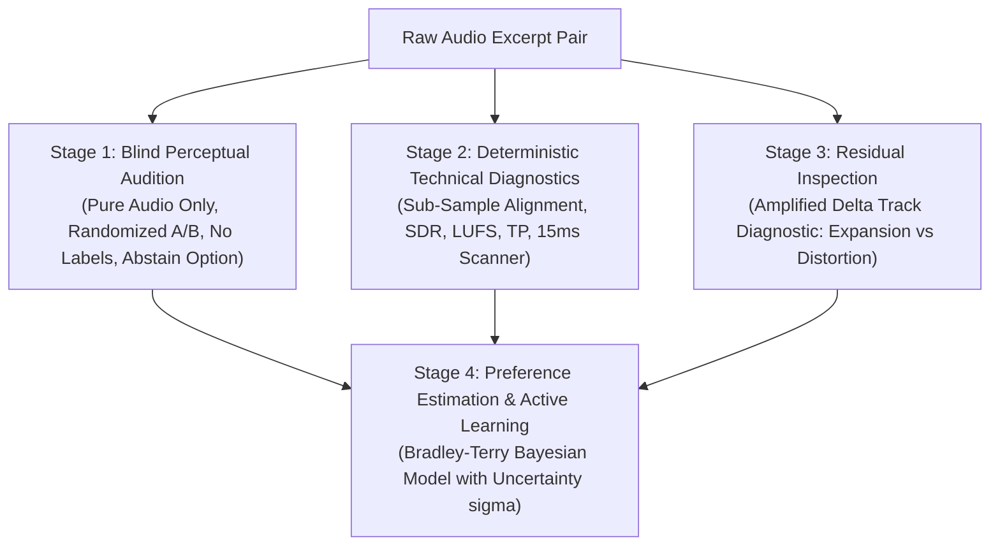

# 🦞 ROACH RESEARCH INSTITUTE — EPISTEMIC STANDARDS & AUDIT PROTOCOL
**Status**: Constitutional Research Standard  
**Authority**: Mission Control Directive (October 10, 2026)  
**Applies to**: All Agents (Gemini, Codex, DeepCoder, DeepSeek, Subagents) and Evaluation Engines

---

## 1. The Seven Evidentiary Tiers

Every significant claim made in code, documentation, benchmarks, reports, or agent communications must explicitly cite its evidentiary tier. Silent promotion across tiers is prohibited.

| Tier | Category | Operational Definition | What It Is NOT |
| :--- | :--- | :--- | :--- |
| **Tier 1** | **Mathematically Proven** | Established by deductive proof under stated axioms (e.g. skew-symmetry $z^T J z = 0$, AVF discrete gradient exact energy conservation $\Delta H + h z^T R z = 0$). | Proof of numerical stability, optimization tractability, or perceptual superiority. |
| **Tier 2** | **Implementation Verified** | Established by reproducible automated tests passing under concrete runtime conditions (e.g. `cargo test`, bit-identical bypass). | Proof of architectural correctness across arbitrary inputs or unverified edge cases. |
| **Tier 3** | **Empirically Observed** | Directly measured physical or computational outcomes (e.g. SDR in dB, BS.1770 LUFS, dBTP, execution latency in milliseconds, thermal delta). | Proof of subjective quality, preference, or causal attribution. |
| **Tier 4** | **Subjectively Preferred** | Formally reported human listener evaluation under blinded or controlled listening protocols. | Proof that the specific mathematical mechanism was the true causal agent of preference. |
| **Tier 5** | **Plausible Hypothesis** | A theoretically coherent mechanism that explains an observed effect but has not been isolated from confounding variables. | Empirical fact or verified discovery. |
| **Tier 6** | **Speculative Concept** | An artistic, heuristic, or exploratory proposal lacking mathematical proof or systematic empirical evidence. | Working algorithm or sound production feature. |
| **Tier 7** | **Unestablished / Unknown** | A domain where available evidence is contradictory, uncalibrated, confounded, or completely absent. | — |

---

## 2. Anti-Self-Deception Checklist

Before declaring any experimental breakthrough or architectural victory, the proposing agent must explicitly answer:

1. **Simpler Explanation**: Could a basic gain adjustment, linear high-shelf, or standard limiter reproduce this outcome?
2. **Falsification Test**: What exact experiment would prove this interpretation wrong?
3. **Baseline Parity**: Was the conventional baseline tested with equal loudness (-11.0 LUFS) and fair tuning?
4. **Target Alignment**: Are we measuring the property we actually care about (listening depth, fatigue, fidelity) or an attractive proxy (FFT slope, raw SDR)?
5. **LLM Receipt Verification**: If an LLM claims to perceive an acoustic nuance, did it demonstrate perceptual evidence (exact lyrics, transient timestamps) or merely parrot the prompt?

---

## 3. ROACH EARS: Strict Four-Stage Architecture

To prevent epistemic contamination, multimodal audio evaluation must separate its four operational layers:

### Operational Rules for ROACH EARS:
1. **Zero Information Leakage**: Stage 1 (Blind Audition) must NEVER receive delta tracks, spectral metrics, file names, or prompt hints.
2. **Abstention is Permitted**: Reviewers must always be permitted to select `"Indistinguishable"` or `"No Reliable Audible Difference"`.
3. **Control Calibration**:
   - **Negative Control**: Bit-identical files ($SDR = \infty$) must yield `"Indistinguishable"` $\ge 95\%$ of the time.
   - **Near-Null Control**: Delta at $-60\text{ dBFS}$ must test whether the model detects or ignores micro-differences.
   - **Positive Control**: Band-limited audio (4 kHz low-pass) must be detected $100\%$ of the time.
4. **Residual Distinction**: An amplified difference signal proves a mathematical modification exists; it does NOT establish whether that modification is musically desirable.

---

## 4. Documentation of Negative Results

Negative results are first-class scientific assets. They eliminate futile search paths and preserve compute.
The following historical failures are explicitly documented in `RESULTS.md`:
- **GTF-B Trajectory Preconditioning**: Coordinate rotation failed to reduce extrinsic curvature under non-linear drift.
- **Cross-Pair Recurrent Memory**: Staggered Givens rotations without energy damping suffered from numerical gradient degradation.
- **M3 Pure Transparency**: Highly conservative geometric memory produced near-null alterations undetectable by human listeners.

Any future experiment that fails its hypothesis must be recorded with equal rigor and prominence.

---

## 5. Continuous Epistemic Audit (Milestone Template)

At every major research milestone, an independent agent must publish the 5-point audit:

1. **Strongest Established Findings**: What is unequivocally verified?
2. **Consequential Unresolved Uncertainties**: Where is our ignorance greatest?
3. **Claims Exceeding Evidence**: Where has eloquence or enthusiasm outrun proof?
4. **Confounding Variables**: What uncontrolled factors could explain the observations?
5. **Highest-Leverage Discriminating Experiments**: What is the cheapest experiment that could overturn our current model?
