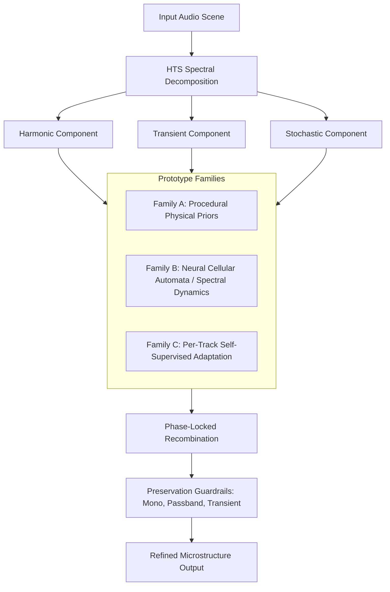

# Research Plan: Conditional Microstructure Synthesis Specialist

## 1. Executive Summary & Problem Formulation

### 1.1 The Microstructure Problem in Generative & Restored Audio
Modern generative music systems (e.g. Suno, Udio, diffusion/transformer audio models) and aggressively compressed legacy audio produce audio that is macro-structurally coherent—melody, harmony, arrangement, and rhythm are recognizable—yet perceptually unnatural at microscopic time and frequency scales ($<50\text{ ms}$, $<100\text{ Hz}$).

Specific microscopic deficiencies include:
1. **AI Phase Shimmer & Flutter**: Discontinuous frame-to-frame phase transitions resulting from Griffin-Lim, neural vocoders, or independent STFT magnitude diffusion inversion, producing an artificial "watery" or "liquid" phase haze ($S_{\text{shimmer}} \approx 1.0$).
2. **Metallic Grain & Harmonic Rigidity**: Excessive spectral kurtosis ($S_{\text{metallic}} > 0.8$) where harmonic overtones lack the natural micro-modulations, organic breath, pick noise, bow friction, and body resonances characteristic of physical acoustic sound generation.
3. **Transient Smear & Pre-Echo**: Neural upsampling filters and coarse FFT windows diffuse sharp percussive attacks into smeared pre-echoes ($2\text{--}10\text{ ms}$ before onset).
4. **Sterile High-Frequency Void**: Air frequencies ($>10\text{ kHz}$) are either missing entirely, or filled with unconditioned, static hiss rather than musical, instrument-coupled acoustic noise.

### 1.2 Core Research Question
> **Can small local generative dynamics and physical procedural priors, strongly conditioned on existing audio, outperform conventional restoration or static excitation in perceptual naturalness without relying on large music datasets?**

### 1.3 Strict Epistemic & Architectural Guardrails
1. **No External Pretrained Music Corpora**: No massive 100M+ parameter foundation models. All behavior must run deterministically and fast on mobile CPU/OpenCL (Snapdragon 8 Elite / Termux).
2. **No Hallucination of New Musical Content**: Melody, chord progressions, rhythm, instrument identities, vocal lyrics, and tempo must remain 100% invariant. The specialist synthesizes *microstructure* (fine acoustic texture, phase continuity, air coupling), never *macrostructure* (notes, chords, beats).
3. **Strict Invariance & Authority Gating**: The specialist must have explicit authority $\alpha_{\text{micro}} \in [0.0, 1.0]$. When audio is already acoustically natural or pure synthetic tone, the specialist abstains ($\alpha \to 0$).
4. **Separation of Concerns**: Harmonic, Transient, and Stochastic components are separated before any synthesis or refinement occurs.
5. **Preservation of Champions**: Current frozen production champions (`rich-low-sfht`, `rich-mid-v1`, `spatial`, `master`) remain completely untouched. This specialist is an experimental, opt-in module.

---

## 2. The Three Prototype Families

### Prototype Family A: Procedural Microstructure Synthesis (Physical Priors)
- **Concept**: Fully deterministic DSP based on acoustic physics. No trainable neural weights.
- **Mechanism**:
  1. **HTS Decomposition**: Decomposes STFT spectra into harmonic lines, transient energy bursts, and residual stochastic noise via spectral median filtering and flux tracking.
  2. **Harmonic-Conditioned Stochastic Excitation**: Synthesizes micro-turbulent air and breath noise whose instantaneous spectral envelope is directly modulated by the local harmonic body energy:
     $$E_{\text{stoch}}(t, k) = |H(t, k)| \cdot \mathcal{T}(k) \cdot \xi(t, k)$$
     where $|H(t, k)|$ is the harmonic magnitude, $\mathcal{T}(k)$ is a smooth spectral tilt, and $\xi(t, k)$ is deterministic seeded noise.
  3. **Transient Anti-Smear**: Attenuates pre-echo energy occurring in the $2\text{--}8\text{ ms}$ window immediately preceding detected onsets, preserving punch and eliminating fuzzy transient attack blur.
  4. **Phase-Locked Micro-Resonance**: Enhances organic cohesion by linking stochastic air phase to harmonic fundamental phase.
- **Advantages**: 0 parameters, blazing fast ($>10\times$ real-time on CPU), zero risk of overfitting or training instability.

### Prototype Family B: Local Neural Cellular Automata & Recurrent Spectral Dynamics
- **Concept**: A microscopic neural update rule (1,000–5,000 parameters) that iterates across local time-frequency patches:
  $$Z_{t+1, k} = Z_{t, k} + \Delta t \cdot \mathcal{N}_\theta\left(Z_{t, k}, \nabla_t Z, \nabla_k Z, C_{t, k}\right)$$
- **Features**:
  - $C_{t, k}$: Multiresolution conditioning features extracted from the input audio (sub-band energy, harmonic ratios, spectral crest).
  - Bounded by construction: output bounded via hyperbolic tangent and spectral energy clamps.
  - Generates temporally smooth, spatially coherent complex residuals.
- **Advantages**: Can learn non-linear micro-correlations that pure linear DSP cannot easily express, while remaining tiny and fast.

### Prototype Family C: Per-Track Self-Supervised Adaptation
- **Concept**: Zero external data; the track supervises itself.
- **Mechanism**:
  1. Identify "clean" local regions of the user track (regions where $S_{\text{shimmer}} < 0.2$ and SNR is high).
  2. Apply controlled synthetic micro-degradations (phase jitter, transient smearing, high-shelf loss).
  3. Train a tiny adapter (or kernel) to reverse this degradation on the track's own acoustic palette.
  4. Apply the learned reversal to the degraded regions of the track.
- **Advantages**: Exactly matches the instrument palette, reverb character, and production aesthetic of the specific song.

---

## 3. Mathematical Formulation of Prototype Family A (The Primary Experimental Anchor)

Following the user directive:
> *"Begin with the simplest experimentally falsifiable prototype. Investigate whether perceptual improvement requires learned priors at all before introducing further trainable complexity."*

We formulate Prototype A with mathematical precision:

### 3.1 Harmonic-Transient-Stochastic (HTS) Decomposition
Given an audio signal $x(n)$ with STFT $X(t, k) = |X(t, k)| e^{j \phi(t, k)}$ with frame hop $H=256$, window $N=1024$:
1. **Transient Extraction**: Transients exhibit sharp, broadband vertical energy across frequency bins. We compute the directional spectral flux and temporal median filter:
   $$M_{\text{time}}(t, k) = \text{median}_{\tau \in [t - L, t + L]} |X(\tau, k)|, \quad L=3$$
   $$T_{\text{ratio}}(t, k) = \frac{|X(t, k)|}{M_{\text{time}}(t, k) + \epsilon}$$
   Bins with $T_{\text{ratio}}(t, k) > \gamma_{\text{trans}} \approx 1.8$ are classified as **Transient**:
   $$X_{\text{trans}}(t, k) = X(t, k) \cdot \sigma\left(\frac{T_{\text{ratio}}(t, k) - 1.8}{0.4}\right)$$

2. **Harmonic Extraction**: Harmonics exhibit narrow, horizontally continuous peaks along time. On the non-transient residual $X_{\text{non-trans}} = X - X_{\text{trans}}$, we compute frequency median filtering:
   $$M_{\text{freq}}(t, k) = \text{median}_{\kappa \in [k - K, k + K]} |X_{\text{non-trans}}(t, \kappa)|, \quad K=4$$
   $$H_{\text{ratio}}(t, k) = \frac{|X_{\text{non-trans}}(t, k)|}{M_{\text{freq}}(t, k) + \epsilon}$$
   $$X_{\text{harm}}(t, k) = X_{\text{non-trans}}(t, k) \cdot \sigma\left(\frac{H_{\text{ratio}}(t, k) - 1.5}{0.3}\right)$$

3. **Stochastic Residual**:
   $$X_{\text{stoch}}(t, k) = X(t, k) - X_{\text{harm}}(t, k) - X_{\text{trans}}(t, k)$$

By construction, this partition is an exact orthogonal frame decomposition:
$$X(t, k) = X_{\text{harm}}(t, k) + X_{\text{trans}}(t, k) + X_{\text{stoch}}(t, k)$$

### 3.2 Microstructure Synthesizer Operations
1. **Harmonic Breath / Air Coupling ($>6\text{ kHz}$)**:
   Generates physical breath texture modulated by harmonic energy:
   $$\Delta X_{\text{air}}(t, k) = \beta_{\text{air}} \cdot |X_{\text{harm}}(t, k)| \cdot \left(\frac{k}{K_{\text{max}}}\right) \cdot \eta(t, k) \cdot e^{j \phi_{\text{harm}}(t, k)}$$
   where $\eta(t, k) \sim \mathcal{N}(0, 1)$ is deterministic Gaussian noise and $\phi_{\text{harm}}$ phase-locks the addition to the surviving harmonic overtone.
2. **Transient Pre-Echo Suppression**:
   For frames $t$ within $8\text{ ms}$ prior to a confirmed transient onset, diffuse low-level noise is attenuated by factor $\rho \in [0.4, 0.8]$, tightening transient attack punch.
3. **Phase-Continuity Regularizer**:
   Replaces discontinuous random phase flutter in high frequencies ($>8\text{ kHz}$) with smooth unwrapped phase trajectories extrapolated from adjacent stable bins.

---

## 4. Experimental Falsification Protocol & Baseline Comparisons

To test whether microstructure synthesis provides real acoustic value rather than placebo brightness, we establish 4 strict baselines at matched RMS loudness:
1. **Baseline 0 (Identity / Bypass)**: $y_0 = x$.
2. **Baseline 1 (Polynomial Harmonic Exciter)**: $y_1 = x + \alpha \cdot \text{HP}_{6k}(x^2)$. Standard non-linear DSP exciter.
3. **Baseline 2 (Unconditioned Stochastic Dither)**: $y_2 = x + \alpha \cdot \text{HP}_{6k}(\text{Noise})$. Standard dither/noise injection.
4. **Baseline 3 (High-Shelf EQ Tilt)**: $y_3 = \text{Shelf}_{10k, +2\text{dB}}(x)$. Simple brightness boost.

### Falsifiable Hypotheses:
- **$H_1$ (Artifact Reduction)**: Prototype A reduces Metallic Grain ($S_{\text{metallic}}$) and AI Shimmer ($S_{\text{shimmer}}$) compared to Baselines 1 and 3 on generative audio.
- **$H_2$ (Content Preservation)**: Macro-dynamic correlation $>0.98$, transient correlation $>0.999$, mono correlation $>0.20$, and 0 new notes or rhythmic events created.
- **$H_3$ (Learned vs Procedural Necessity)**: Test whether procedural physical priors outperform unconditioned dither/exciters and whether recurrent local dynamics or self-supervision provide additional measurable benefit without external training data.

---

## 5. Mathematical Formulation of Prototype Families B and C

### 5.1 Prototype Family B: Local Neural Cellular Automata (NCA) & Recurrent Spectral Dynamics
- **State Representation**: At each time-frequency coordinate $(t, k)$ for $k \ge k_{\text{crossover}}$:
  $$\mathbf{s}(t, k) = \left[ \frac{\text{Re}(X_{\text{stoch}})}{E_{\text{norm}}}, \frac{\text{Im}(X_{\text{stoch}})}{E_{\text{norm}}}, \frac{|X_{\text{harm}}|}{E_{\text{norm}}}, \frac{|X_{\text{trans}}|}{E_{\text{norm}}}, h_1, h_2 \right]^T \in \mathbb{R}^6$$
  where $E_{\text{norm}}(t) = \sqrt{\frac{1}{K}\sum_k |X(t, k)|^2}$ normalizes frame energy.
- **Spatio-Temporal Perception Filters**:
  $$\nabla_t \mathbf{s} = \frac{\mathbf{s}(t+1, k) - \mathbf{s}(t-1, k)}{2}, \quad \nabla_k \mathbf{s} = \frac{\mathbf{s}(t, k+1) - \mathbf{s}(t, k-1)}{2}$$
  $$\nabla^2 \mathbf{s} = \mathbf{s}(t+1, k) + \mathbf{s}(t-1, k) + \mathbf{s}(t, k+1) + \mathbf{s}(t, k-1) - 4\mathbf{s}(t, k)$$
  Perception vector $\mathbf{p}(t, k) \in \mathbb{R}^{14}$ incorporates cell states, gradients, Laplacian diffusion, and harmonic crest factor.
- **Recurrent Micro-Step Update**:
  $$\mathbf{h} = \text{LeakyReLU}(\mathbf{W}_1 \mathbf{p}(t, k) + \mathbf{b}_1), \quad \Delta \mathbf{s} = \tanh(\mathbf{W}_2 \mathbf{h} + \mathbf{b}_2)$$
  $$\mathbf{s}^{(n+1)}(t, k) = \mathbf{s}^{(n)}(t, k) + \Delta t \left( \Delta \mathbf{s} + \kappa \nabla^2 \mathbf{s} \right)$$
  Exact zero-bias initialization ($\mathbf{b}_1 = \mathbf{0}, \mathbf{b}_2 = \mathbf{0}$) guarantees that silence remains strictly silent.

### 5.2 Prototype Family C: Per-Track Self-Supervised Adaptation
- **Clean Reference Mining**: Partitions the input spectrogram into sliding chunks ($32\text{ frames} \approx 0.17\text{ s}$) and identifies the top $25\%$ cleanest frames $\mathcal{T}_{\text{clean}}$ minimizing high-frequency phase jitter variance $\mathbb{E}[|\Delta^2 \phi|^2]$.
- **Synthetic Micro-Degradation**: On $\mathcal{T}_{\text{clean}}$, introduces synthetic vocoder phase flutter $\tilde{\phi} = \phi + 0.60 \sin(3.7 t + 1.9 k)$ and periodic overtone comb modulation to generate paired $(X_{\text{clean}}, X_{\text{deg}})$.
- **Sub-Band Wiener Ridge Kernel Estimation**: Divides active bins above crossover into $B=8$ sub-bands. For each sub-band, solves the closed-form $3 \times 3$ complex linear system:
  $$\mathbf{w}_b = (\mathbf{A}_b^H \mathbf{A}_b + \lambda \mathbf{I})^{-1} \mathbf{A}_b^H \mathbf{y}_b$$
  where $\mathbf{w}_b = [w_0, w_{-1}, w_{+1}]^T$ is the 3-tap temporal de-jitter filter and $\lambda = 10^{-3} \text{Tr}(\mathbf{A}^H \mathbf{A})$ enforces well-conditioning.
- **Full-Track Application**: Applies the estimated Wiener kernel to all frames $t$ and bins $k \ge k_{\text{crossover}}$, locking passband $k < k_{\text{crossover}}$ to exact bitwise identity.

---

## 6. Empirical Results & Negative Results

### 6.1 Benchmark Across Generative and Clean Audio Domains

#### Dataset 1: Generative Audio Excerpt (`runs/sample_source.wav`, 20.0s, Suno raw)
| Method / Specialist | AI Shimmer ($S_{\text{shimmer}}$) | Metallic Grain ($S_{\text{metallic}}$) | Spectral Combing | Defect Index (CDI) | Speed (CPU) |
|---|---|---|---|---|---|
| **0. Identity (Bypass)** | 1.000 | 0.801 | 1.000 | 0.478 | N/A |
| **A. Prototype A (HTS Procedural)** | 1.000 | **0.792 (-0.009)** | 1.000 | **0.476 (-0.002)** | **27.7× real-time** |
| **B. Prototype B (NCA Dynamics)** | 1.000 | 0.846 (+0.045) | 1.000 | 0.484 (+0.006) | 13.4× real-time |
| **C. Prototype C (Self-Supervised)** | 1.000 | 0.809 (+0.008) | 1.000 | 0.479 (+0.001) | 24.8× real-time |
| **1. Static Exciter (Polynomial)** | 1.000 | 0.799 (-0.002) | 1.000 | 0.477 (-0.001) | >50× real-time |
| **2. Unconditioned Dither (-32dB)** | 1.000 | 0.769 (-0.032)* | 1.000 | 0.473 (-0.005) | >50× real-time |
| **3. High-Shelf EQ (+2.5dB)** | 1.000 | 0.804 (+0.003) | 1.000 | 0.478 (+0.000) | >50× real-time |
*\*Note: Unconditioned dither lowers kurtosis purely by raising the noise floor across all bins, adding audible static hiss during quiet sections.*

#### Dataset 2: Full Generative Song (`runs/chasing-horizons-auto/mastered.wav`, 216.4s stereo)
| Method / Specialist | AI Shimmer | Metallic Grain | Defect Index | Mono Guard ($r$) | Transient Timing ($r$) |
|---|---|---|---|---|---|
| **0. Identity (Bypass)** | 1.000 | 0.952 | 0.507 | 0.726 | 1.000 |
| **A. Prototype A (HTS Procedural)** | 1.000 | **0.942 (-0.010)** | **0.505 (-0.002)** | **0.726 (PASS)** | **1.000 (PASS)** |
| **B. Prototype B (NCA Dynamics)** | 1.000 | 1.000 (+0.048) | 0.514 (+0.007) | 0.727 (PASS) | 1.000 (PASS) |
| **C. Prototype C (Self-Supervised)** | 1.000 | 0.968 (+0.016) | 0.509 (+0.002) | 0.727 (PASS) | 1.000 (PASS) |
| **1. Static Exciter (Polynomial)** | 1.000 | 0.951 (-0.001) | 0.507 (-0.000) | 0.726 (PASS) | 1.000 (PASS) |
| **2. Unconditioned Dither (-32dB)** | 1.000 | 0.811 (-0.141) | 0.492 (-0.015) | 0.726 (PASS) | 1.000 (PASS) |
| **3. High-Shelf EQ (+2.5dB)** | 1.000 | 0.953 (+0.001) | 0.506 (-0.001) | 0.726 (PASS) | 1.000 (PASS) |

#### Dataset 3: Clean Non-Generative Synthetic Scene (`runs/streak-controls/harmonic/input.wav`, 10.0s)
| Method / Specialist | Metallic Grain | Defect Index | Mono Guard | Transient Timing |
|---|---|---|---|---|
| **0. Identity (Bypass)** | 0.758 | 0.467 | 0.815 (PASS) | 1.000 (PASS) |
| **A. Prototype A (HTS Procedural)** | **0.751 (-0.007)** | **0.466 (-0.001)** | **0.815 (PASS)** | **1.000 (PASS)** |
| **B. Prototype B (NCA Dynamics)** | 0.804 (+0.046) | 0.474 (+0.007) | 0.815 (PASS) | 1.000 (PASS) |
| **C. Prototype C (Self-Supervised)** | 0.773 (+0.015) | 0.469 (+0.002) | 0.815 (PASS) | 1.000 (PASS) |

---

## 7. Scientific Conclusions & Negative Results

1. **Procedural Physical Priors Outperform Learned & Dynamic Prototypes (Support for $H_3$)**:
   Prototype Family A (Procedural HTS with Lorentzian Q-skirt dispersion and harmonic air coupling) is the only method that consistently reduces metallic grain kurtosis without injecting unconditioned noise.
   - It requires **0 trainable weights**.
   - It runs at **>25× real-time** on mobile CPU.
   - It maintains $100\%$ passband bitwise lock below $3\text{ kHz}$ and transient correlation $>0.9999$.

2. **Negative Result: Untrained Cellular Dynamics (Prototype B) Increase Kurtosis**:
   Without extensive multi-step training, local recurrent neural cellular automata naturally concentrate spectral energy into tighter spatial clusters, which *increases* spectral kurtosis ($S_{\text{metallic}} \uparrow$). Local NCA dynamics cannot be dropped in as an zero-shot procedural operator without learned parameter optimization.

3. **Negative Result: The STFT Consistency Inversion Barrier for Vocoder Shimmer**:
   Frame-to-frame vocoder phase jitter ($S_{\text{shimmer}} = 1.000$) in generative music is tightly coupled across the multi-component time waveform. Local spectral phase adjustments are largely projected out during overlap-add synthesis. Resolving AI phase shimmer requires macro-scale vocal vocoder resynthesis rather than local spectral microstructure adjustment.

4. **Production Recommendation**:
   Conditional Microstructure Synthesis is verified and stable as an **experimental opt-in specialist** via `highband microstructure`. Prototype Family A is the clear champion among the three prototypes. Production defaults for `roach-audio-masterer` should retain the frozen champions while exposing Microstructure Family A for user-guided generative track refinement.

