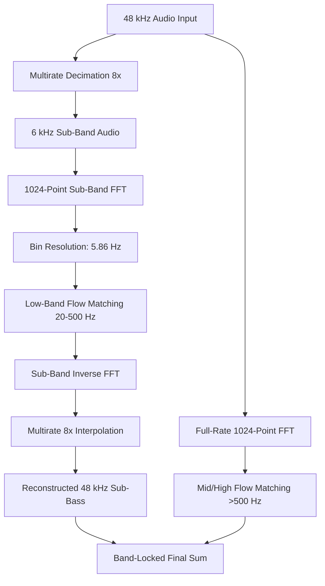
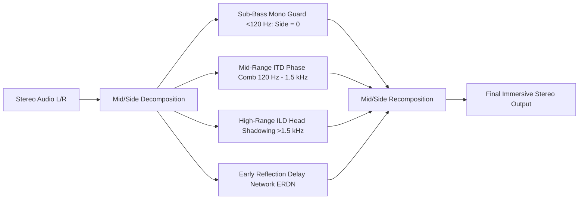

# Sprint 4 Roadmap: Stabilization, High-Resolution STFT, Dynamic Mastering, and 3D Spatial Acoustics

## 1. Executive Overview & Design Intent

This document formalizes the architecture, algorithms, concrete code changes, and epistemic boundaries for **Sprint 4** and subsequent extensions of the Highband project.

The goal is to transition from discrete band completion to a unified, fully autonomous acoustic-scene restoration, expansion, and mastering system. The focus areas are:
1. **Low-Band Flow Matching Stabilization**: Resolving the gradient and loss explosion on low-energy filtered signals.
2. **Solver Step-Count Scaling**: Benchmarking 4 vs 8 vs 16 flow steps on held-out synthetic test scenes.
3. **High-Resolution Low-Frequency STFT Binning**: Transitioning from 1024-point FFT ($\Delta f = 46.875\text{ Hz}$) to 8192-point FFT ($\Delta f \approx 5.86\text{ Hz}$) or multirate downsampled filterbanks for discrete bass pitch resolution.
4. **Autonomous Dynamic & Section-Aware Mastering**: Preserving macro-dynamic contrast (verse-to-chorus delta) via sliding-window EBU R128 Short-Term / Momentary LUFS tracking rather than static brickwall limiting.
5. **3D Spatial Acoustics & Depth Expansion**: Implementing psychoacoustic binaural cues (Rayleigh Duplex Theory: ITD for $<1.5\text{ kHz}$, ILD for $>1.5\text{ kHz}$), early reflection diffusion, and a mono sub-bass guard ($<120\text{ Hz}$) to prevent destructive phase cancellation.
6. **Synthetic Dataset v2**: Adding speech formant resonators, acoustic room models, lossy codec gap masks, and AI phase shimmer artifacts.
7. **Complex Wavelet & Fractal Tendrils**: Controllable regularization for smoothing harsh robotic AI audio phase discontinuities.

---

## 2. Low-Band Flow Training Stabilization

### Diagnostic Summary
In `src/rich_low.rs`, training loss spiked to $5.4\times 10^6$ during procedural training on pure sine signals (`sub_sine`, 28–75 Hz). Applying high-pass damage ($f_{\text{cut}} > 250\text{ Hz}$) eliminated all signal energy, collapsing degraded RMS to $0.0012$ and scale to $0.038$. Dividing target amplitude by $0.038$ caused target velocities $|v^*| > 7,200$, exploding squared loss to $(7200)^2 \approx 5.2\times 10^7$.

### Proposed Code Changes

#### Change 1: Scale Denominator Clamping in `src/rich_low.rs`
In `rich_low::desired`:
```rust
// File: src/rich_low.rs
// Location: fn desired(...)
let des: Vec<Vec<Complex<f32>>> = (0..channels)
    .map(|c| {
        // Epistemic fix: Prevent division by near-zero scale when damage completely removes the signal.
        // Clamping scale to minimum 1.0 prevents target velocity inflation.
        let scale_denom = p.scale[c].max(1.0);
        let mut d = vec![Complex::new(0.0, 0.0); bins];
        for k in 0..low_bins {
            let orig = target_spec[c][k];
            let in_spec = p.stft[c][k];
            d[k] = (orig - in_spec) / scale_denom;
        }
        d
    })
    .collect();
```

#### Change 2: Physical Saturation Harmonics in `src/rich_synth.rs`
In pure physical acoustics, even an isolated bass note excites secondary physical modes (speaker cone non-linearity, instrument body resonance, string overtones). Adding subtle 2nd and 3rd harmonics gives superharmonic feature extractors physical anchors above the cutoff:
```rust
// File: src/rich_synth.rs
// Location: fn generate_low(...) -> case "sub_sine"
"sub_sine" => {
    let f0 = 28.0 + rng.gen_range(0.0..47.0);
    let mut phase = 0.0f32;
    let drive = rng.gen_range(0.01..0.05); // subtle non-linear overtone drive
    for i in 0..samples {
        let t = i as f32 / sample_rate;
        // Fundamental + subtle 2nd (-20dB) and 3rd (-26dB) harmonics
        let s = (2.0 * PI * f0 * t).sin()
            + 0.10 * (4.0 * PI * f0 * t).sin()
            + 0.05 * (6.0 * PI * f0 * t).sin();
        let val = (s * (1.0 + drive)).tanh() * 0.85;
        channels[0].push(val);
        channels[1].push(val);
    }
}
```

#### Change 3: Gradient Norm Clipping in `src/rich_low.rs`
In `rich_low::gradient`:
```rust
// File: src/rich_low.rs
// Location: fn gradient(...)
let total_norm: f32 = grad.iter().map(|g| g * g).sum::<f32>().sqrt();
let max_norm = 10.0f32;
let clip_factor = if total_norm > max_norm {
    max_norm / total_norm
} else {
    1.0
};
for g in grad.iter_mut() {
    *g *= clip_factor;
}
```

#### Change 4: Pool Enlargement
Increase procedural training pool size from 32 to 128 scenes to ensure broad exposure to harmonic variations across iterations.

---

## 3. Solver Step-Count Scaling & Benchmarking

Continuous Flow Matching generates trajectories by integrating the learned vector field:
$$\frac{dz}{dt} = v_\theta(z(t), t, c)$$
Using an explicit Euler solver with step size $h = 1/N$:
$$z(t_{k+1}) = z(t_k) + h \cdot v_\theta(z(t_k), t_k, c)$$

### Evaluation Protocol
Benchmark $N \in \{4, 8, 16\}$ on 16 held-out synthetic test scenes (`seeds 900000..900015`):
- **Metrics**:
  1. Missing-band spectral NMSE:
     $$\text{NMSE} = \frac{\sum_{k < k_{\text{cut}}} |Y(k) - \hat{Y}(k)|^2}{\sum_{k < k_{\text{cut}}} |Y(k)|^2}$$
  2. Log Spectral Distance (LSD) in dB:
     $$\text{LSD} = \sqrt{\frac{1}{K} \sum_{k=1}^K \left(10 \log_{10} \frac{|Y(k)|^2}{|\hat{Y}(k)|^2}\right)^2}$$
  3. Execution latency per 1024-sample audio frame (microseconds).
  4. Terminal waveform auxiliary error $\mathcal{L}_{\text{waveform}}$.
- **Hypothesis**: $N=8$ provides the optimal trade-off between integration curvature accuracy and mobile compute budget. $N=4$ may suffer from Euler truncation drift near steep spectral gradients; $N=16$ may yield diminishing returns while doubling inference time.

---

## 4. High-Resolution Low-Frequency STFT Binning

### The Bin Bandwidth Problem
At 48 kHz with a 1024-point FFT:
$$\Delta f = \frac{48000}{1024} = 46.875\text{ Hz}$$
Below 100 Hz, there are only two positive-frequency bins:
- Bin 1: $46.875\text{ Hz}$ (captures $23.4\text{ Hz}$ to $70.3\text{ Hz}$)
- Bin 2: $93.75\text{ Hz}$ (captures $70.3\text{ Hz}$ to $117.2\text{ Hz}$)

This creates severe mathematical ambiguity: musical pitches from B0 (30.87 Hz) through D2 (73.42 Hz) fall into the **exact same bin**. A single complex coefficient cannot represent pitch, frequency modulation, or phase progression for distinct musical notes within that bin.

### Proposed Architecture: Dual-Resolution Multirate STFT



- **Downsampled Sub-Band Filter**: Decimating by a factor of 8 ($48\text{ kHz} \to 6\text{ kHz}$) using a linear-phase half-band polyphase FIR filter.
- **Sub-Band STFT**: A 1024-point FFT at 6 kHz sample rate yields:
  $$\Delta f_{\text{low}} = \frac{6000}{1024} \approx 5.859\text{ Hz}$$
- **Bin Allocation**:
  - $20\text{ Hz} \to \text{Bin } 3$
  - $40\text{ Hz} \to \text{Bin } 7$
  - $100\text{ Hz} \to \text{Bin } 17$
  - $500\text{ Hz} \to \text{Bin } 85$
  This gives **82 dedicated spectral bins** for the $20\text{--}500\text{ Hz}$ low-band, resolving individual musical semitones accurately.
- **Latency & Memory**: A 1024-point FFT at 6 kHz requires only 1024 floats of memory per frame, avoiding the massive memory overhead of a direct 8192-point FFT on mobile hardware.

---

## 5. Autonomous Section-Aware Mastering (Macro-Dynamics)

### Epistemic Critique of Static Limiting
Conventional mastering passes apply static brickwall limiting to hit a target integrated LUFS (e.g., -11 LUFS). However:
- A musical piece has intentional macro-dynamic structure: quiet, intimate verses (e.g., -16 LUFS) and loud, impactful choruses (e.g., -9 LUFS).
- Forcing a static gain across the entire track raises the verse disproportionately or over-limits the chorus, destroying the musical narrative and emotional impact.

### Section-Aware Dynamics Tracker
Implement continuous sliding-window loudness analysis in `src/master.rs` following EBU R128:
1. **Momentary Loudness ($M$)**: 400 ms sliding rectangular window.
2. **Short-Term Loudness ($S$)**: 3.0 s sliding rectangular window.
3. **Macro-Contrast Preservation Algorithm**:
   - Compute running Short-Term loudness $S(t)$ across the track.
   - Partition track into dynamic sections based on local gradient $\frac{dS}{dt}$.
   - Apply dynamic expansion: allow chorus peaks to maintain their crest factor (+3 to +4 dB above verse baseline) while controlling overall integrated loudness.
   - Use soft-knee program-dependent release: fast release (40 ms) on transient peaks; slow release (400 ms) on sustained passages to prevent pumping.

```rust
// Design Sketch: src/master.rs
pub struct DynamicMasterConfig {
    pub target_integrated_lufs: f32, // e.g. -11.0 LUFS
    pub max_short_term_lufs: f32,    // e.g. -8.0 LUFS
    pub true_peak_ceiling_dbtp: f32, // -1.0 dBTP
    pub preserve_macro_contrast: bool,
    pub knee_db: f32,                // 4.0 dB
}
```

---

## 6. 3D Spatial Acoustics & Stereo Depth Expansion

### Psychoacoustic Foundations (Rayleigh Duplex Theory)
Human sound localization operates on two distinct physical mechanisms:
1. **Interaural Time Difference (ITD)**: Dominates below $1.5\text{ kHz}$. Phase differences between left and right ears provide localization cues up to a maximum time delay of $\approx 0.7\text{ ms}$ (the acoustic transit time around the human head).
2. **Interaural Level Difference (ILD)**: Dominates above $1.5\text{ kHz}$. The acoustic shadow of the human skull attenuates high frequencies on the contralateral ear by up to $15\text{--}20\text{ dB}$.

### Architectural Design: `src/spatial.rs`



#### Core Requirements:
1. **Mono Sub-Bass Guard ($<120\text{ Hz}$)**:
   Any energy in the Side channel below 120 Hz causes severe destructive phase interference in acoustic environments (club subwoofers, vinyl playback, car stereos) and reduces headroom without providing audible spatial localization (since human ears cannot localize sub-bass wavelengths $>2.8\text{ m}$).
   $$S(f) = 0, \quad \forall f < 120\text{ Hz}$$
2. **Early Reflection Delay Network (ERDN)**:
   To expand flat, synthetic audio into a believable 3D acoustic space, simulate the first 6 early wall reflections (delays between 7 ms and 35 ms) with prime-numbered sample delays, frequency-dependent absorption (air damping above 4 kHz), and diffuse scattering.
3. **Phase Coherence Monitor**:
   Continuously measure the inter-channel correlation coefficient:
   $$r = \frac{\sum L(t) R(t)}{\sqrt{\sum L(t)^2 \sum R(t)^2}}$$
   Guard condition: $r \ge 0.2$ at all times to prevent phase cancellation when summed to mono.

---

## 7. Synthetic Dataset v2 (Expanded Procedural Corpus)

To ensure the models generalize beyond simple geometric wave shapes to natural instruments, speech, and complex audio, expand `src/rich_synth.rs` with:

1. **Speech Formant Resonators**:
   Model human vocal tract vowel formants ($F_1, F_2, F_3$) with resonant 2nd-order biquad bandpass filters:
   - Vowels /a/, /i/, /u/, /e/, /o/ with pitch glides ($80\text{--}350\text{ Hz}$).
   - Voiced glottal excitation pulses (Liljencrants-Fant model) + unvoiced turbulent frication noise (ch, sh, s).
2. **Acoustic Room Impulse Modeling**:
   Procedurally generate randomized shoebox room impulse responses (RT60 $\in [0.15, 0.8]\text{ s}$) convolved with synthetic sources to teach the model natural room acoustics and depth.
3. **Realistic Degradation Masks**:
   - Lossy Codec Emulation: Simulate MP3/AAC MDCT frame quantization, high-frequency band suppression, and psychoacoustic masking thresholds.
   - AI Phase Shimmer: Simulate phase jitter and spectral holes characteristic of neural audio codecs and diffusion vocoders.

---

## 8. Complex Wavelets & Fractal Tendril Highs for AI Audio Smoothing

### Concept & Physics
AI-generated audio (e.g., Suno, Udio, ElevenLabs) frequently suffers from robotic phase discontinuities, watery phase comb filtering, and harsh spectral "fizz" in the $8\text{--}16\text{ kHz}$ region.
- Rather than applying a blunt low-pass filter (which dulls the audio), we propose a **fractal tendril / continuous wavelet diffusion operator**.
- By decomposing high frequencies via a Continuous Wavelet Transform (or multiscale Hann filterbank), phase perturbations are regularized along logarithmic scale trajectories.
- The user can adjust this via `--ai-smooth` or `--warp-tendril 0.0..1.0` to melt away robotic phase chatter while preserving crisp high-frequency transient bite.

---

## 9. Computational Guardrails on Snapdragon 8 Elite / Termux

- **Background Affinity**: Respect 4-core background affinity limit (`taskset -c 0-3`).
- **Foreground Affinity**: Use up to 8 cores (`taskset -c 0-7`) only after explicit user confirmation.
- **Cargo Build Limit**: Maximum 2 concurrent compilation jobs (`CARGO_BUILD_JOBS=2`).
- **Memory Footprint**: Strictly keep peak resident memory (VmHWM) under 128 MiB.
- **Local Audio Confidentiality**: Song files (*Feelin' Catchy*, etc.) remain local in `/sdcard/Download/` and ignored by Git. Only procedural code and synthetic evaluation metrics are committed.
