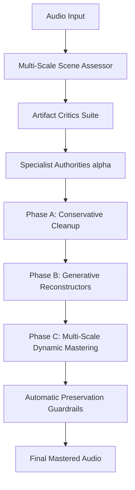

# Sprint 5: Autonomous Specialist Engine, Dedicated Artifact Critics, and Multi-Scale Mastering

## 1. Executive Overview & Design Intent

This document formalizes the architecture, algorithms, mathematical formulations, and evaluation protocols for transitioning Highband into an **autonomous acoustic-scene mastering and refinement engine**.

The core requirement is that rather than requiring a human user to manually guess settings or band cutoffs, each restoration stage operates as an **autonomous specialist** endowed with:
1. **Explicit Learned Authority & Abstention**: Each module estimates its own confidence $\alpha_i \in [0.0, 1.0]$. When input audio is healthy or intact in a domain, the module abstains ($\alpha_i \to 0.0$), leaving the signal untouched.
2. **Cross-Band Conditioning with Strictly Bounded Write Authority**: Specialists condition their predictions across the full frequency spectrum (e.g., sub-bass reads mid-frequency superharmonics; midrange reads sub fundamentals; air reads mid-range transient attacks), but their write authority is strictly bounded to their designated band.
3. **Tri-Phase Separation of Concerns**:
   - **Phase A (Conservative & Reversible)**: Phase alignment, sub-bass mono centering, de-fizz smoothing, and minimum-statistics denoise.
   - **Phase B (Generative & Reconstructive)**: Missing-band completion (SFHT sub-bass, Mid flow, Basis high-band air) and 3D Early Reflection Delay Network (ERDN).
   - **Phase C (Macro-Dynamic Mastering)**: Section-aware sliding-window loudness tracking, high-pass sidechain glue compression, and lookahead peak limiting.
4. **Dedicated Objective Artifact Critics**: Quantitative critics for AI shimmer, metallic grain, spectral combing, codec swish, phase haze, sub instability, and over-wide transients.
5. **Multi-Time-Scale Dynamics**: Processing spanning millisecond transient attacks ($0.1\text{--}5\text{ ms}$), sub-second spectral/spatial dynamics ($20\text{--}500\text{ ms}$), and multi-second section structure ($1\text{--}10\text{ s}$).
6. **Automatic Preservation Guardrails**: Rigorous verification of mono compatibility ($r \ge 0.20$), passband invariance, and transient timing correlation.

---

## 2. Dedicated Objective Artifact Critics Suite

The engine incorporates 7 dedicated critics in `src/critics.rs`. Each critic evaluates a specific physical or perceptual artifact and maps it to a normalized defect score $S \in [0.0, 1.0]$:

### Critic 1: AI Phase Shimmer Critic ($S_{\text{shimmer}}$)
- **Domain**: Neural audio codec / diffusion vocoder phase jitter in the $8\text{--}16\text{ kHz}$ region.
- **Formulation**: Computes the second-difference phase variance across consecutive spectral frames:
  $$\Delta^2 \phi(t, k) = \left[(\phi(t+1, k) - \phi(t, k)) - (\phi(t, k) - \phi(t-1, k))\right] \pmod{2\pi}$$
  $$S_{\text{shimmer}} = \text{clamp}\left(\frac{\mathbb{E}[|\Delta^2 \phi|] - 0.70}{1.0}, 0.0, 1.0\right)$$
- **Physics**: Natural acoustic instruments and unquantized audio maintain continuous phase trajectories ($\mathbb{E}[|\Delta^2 \phi|] < 0.7\text{ rad}$); neural generative vocoders produce discontinuous phase flutter ($\mathbb{E}[|\Delta^2 \phi|] > 1.4\text{ rad}$). Gated to evaluate only when high-band energy is active ($E_{\text{high}} > 0.002 E_{\text{total}}$).

### Critic 2: Metallic Grain Critic ($S_{\text{metallic}}$)
- **Domain**: Unnatural spectral kurtosis and modulation bursts in $3\text{--}8\text{ kHz}$.
- **Formulation**: Measures fourth standardized moment (kurtosis) of spectral magnitude slices:
  $$\text{Kurtosis}(t) = \frac{\frac{1}{K}\sum_{k} (|X(t, k)| - \mu_t)^4}{\sigma_t^4}$$
  $$S_{\text{metallic}} = \text{clamp}\left(\frac{\mathbb{E}[\text{Kurtosis}] - 4.0}{6.0}, 0.0, 1.0\right)$$
- **Physics**: Gaussian noise and natural musical passages exhibit moderate spectral kurtosis ($\approx 3.0$); harsh metallic ringing and robotic algorithmic artifacts produce spiky resonant outliers ($\text{Kurtosis} > 7.0$).

### Critic 3: Spectral Combing Critic ($S_{\text{combing}}$)
- **Domain**: Periodic log-magnitude ripple indicative of acoustic phase cancellation or bad Haas decorrelation.
- **Formulation**: Evaluates the normalized frequency-lag autocorrelation of detrended spectral log-magnitudes:
  $$R_{XX}(\Delta k) = \frac{\sum_k \tilde{L}(k) \tilde{L}(k + \Delta k)}{\sum_k \tilde{L}(k)^2}, \quad \tilde{L}(k) = \log_{10} |X(k)| - \mu_L$$
  $$S_{\text{combing}} = \text{clamp}\left(\frac{\max_{\Delta k \in [4, 32]} R_{XX}(\Delta k) - 0.35}{0.40}, 0.0, 1.0\right)$$
- **Physics**: Comb filtering produces pronounced periodic ripples ($R_{XX} > 0.5$); gated to require active broadband energy and at least 3 distinct spectral peaks to avoid false positives on isolated monophonic sine tones.

### Critic 4: Codec Swish Critic ($S_{\text{swish}}$)
- **Domain**: Temporal frame-to-frame log-energy fluctuation in lossy MDCT bands ($10\text{--}18\text{ kHz}$).
- **Formulation**: Measures frame-to-frame jumpiness in high-band energy:
  $$D_{\text{swish}} = \mathbb{E}\left[\left|\ln \frac{E_{\text{high}}(t)}{E_{\text{high}}(t-1)}\right|\right]$$
  $$S_{\text{swish}} = \text{clamp}\left(\frac{D_{\text{swish}} - 0.8}{1.0}, 0.0, 1.0\right)$$

### Critic 5: Phase Haze Critic ($S_{\text{haze}}$)
- **Domain**: Diffuse, incoherent Mid/Side phase distribution across $1\text{--}10\text{ kHz}$.
- **Formulation**: Proportion of time-frequency bins where Side magnitude severely outstrips Mid magnitude:
  $$S_{\text{haze}} = \text{clamp}\left(\frac{\mathbb{P}(|S(t, k)| > 1.5 |M(t, k)|) - 0.15}{0.35}, 0.0, 1.0\right)$$

### Critic 6: Sub Instability Critic ($S_{\text{sub\_instab}}$)
- **Domain**: Energy leakage in the Side channel below 120 Hz and instantaneous sub-bass pitch jitter.
- **Formulation**: Ratio of sub-bass Side energy to total sub-bass energy ($E_{\text{mid}} + E_{\text{side}}$):
  $$\text{Leak}_{\text{sub}} = \frac{E_{\text{side, } <120\text{Hz}}}{E_{\text{mid, } <120\text{Hz}} + E_{\text{side, } <120\text{Hz}}}$$
  $$S_{\text{sub\_instab}} = \text{clamp}\left(\frac{\text{Leak}_{\text{sub}}}{0.15}, 0.0, 1.0\right)$$
- **Physics**: Human hearing cannot localize wavelengths $>2.8\text{ m}$; out-of-phase sub-bass ($>10\%$) causes severe phase cancellation on mono playback systems, club subwoofers, and vinyl cutters. Anti-phase sub-bass produces $S_{\text{sub\_instab}} = 1.0$.

### Critic 7: Over-Wide Transient Critic ($S_{\text{overwide}}$)
- **Domain**: Transients where high-frequency side energy vastly exceeds mid energy during attack onsets ($0\text{--}5\text{ ms}$).
- **Formulation**: Rate of detected onsets where attack Side energy exceeds Mid energy by $>1.2\times$:
  $$S_{\text{overwide}} = \frac{N(\text{onset} \land E_{\text{side, attack}} > 1.2 E_{\text{mid, attack}})}{N(\text{onsets})}$$

---

## 3. Explicit Specialist Authorities & Learned Abstention

Rather than relying on brittle heuristic flags, the engine computes an **authority vector**:
$$\vec{\alpha} = (\alpha_{\text{sub}}, \alpha_{\text{mid}}, \alpha_{\text{high}}, \alpha_{\text{spatial}}, \alpha_{\text{defizz}}, \alpha_{\text{master}}) \in [0.0, 1.0]^6$$

### Learned Abstention Rules:
1. **Sub-Bass Specialist ($\alpha_{\text{sub}}$)**:
   - If sub-bass energy is already strong ($>-32\text{ dBFS}$) and centered ($S_{\text{sub\_instab}} < 0.05$), $\alpha_{\text{sub}} = 0.0$ (**ABSTAIN**).
   - If sub-bass energy is missing ($<-42\text{ dBFS}$) or damaged, $\alpha_{\text{sub}} \in [0.5, 0.9]$.
2. **High-Field Specialist ($\alpha_{\text{high}}$)**:
   - If audio already exhibits native full bandwidth ($\ge 20\text{ kHz}$), $\alpha_{\text{high}} = 0.0$ (**ABSTAIN**).
   - If cutoff is $< 10\text{ kHz}$, $\alpha_{\text{high}} = 0.90$.
3. **Spatial Specialist ($\alpha_{\text{spatial}}$)**:
   - If audio is pure mono ($r > 0.99$), $\alpha_{\text{spatial}} = 0.0$ (**ABSTAIN**). Prevents artificial Haas decorrelation or false widening of monophonic vocals and speech.
   - If out-of-phase bass is detected ($\text{Leak}_{\text{sub}} > 0.06$), $\alpha_{\text{spatial}} = 0.90$ (activates Linkwitz-Riley LR4 mono guard).
4. **Conservative De-fizz ($\alpha_{\text{defizz}}$)**:
   - Gated directly by $S_{\text{shimmer}}$ and $S_{\text{metallic}}$. If critics report $<0.25$, $\alpha_{\text{defizz}} = 0.0$ (**ABSTAIN**).
5. **Mastering Glue ($\alpha_{\text{master}}$)**:
   - If crest factor is already crushed ($<9.0\text{ dB}$), $\alpha_{\text{master}} = 0.20$ to avoid further dynamic squashing.

---

## 4. Multi-Time-Scale Architecture

Acoustic dynamics occur across three distinct mathematical time horizons:

| Time Scale | Horizon | Acoustic Phenomena | Implemented Specialist Operations |
|---|---|---|---|
| **Millisecond** | $0.1\text{--}5\text{ ms}$ | Transient click/snap, attack sharpness, sample clipping, zero-crossings | Lookahead brickwall limiter (96 samples = 2.0 ms), polyphase true-peak detection, clipper recovery |
| **Sub-Second** | $20\text{--}500\text{ ms}$ | Harmonic spectral envelopes, early reflection diffusion, glue compression envelope | 8-step SFHT / Mid flow matching, ERDN prime delay lines (7.1–34.7 ms), soft-knee glue compressor (20 ms attack / 160 ms release) |
| **Multi-Second** | $1.0\text{--}10.0\text{ s}$ | Verse-to-chorus macro dynamics, EBU R128 loudness trajectory, musical breathing | Sliding-window Short-Term (3.0 s) / Momentary (400 ms) LUFS tracking, program-dependent release, dynamic range (LRA) preservation |

---

## 5. Automatic Preservation Guardrails

Before audio is finalized, the preservation suite verifies strict physical invariants:
1. **Mono Compatibility Guard**:
   $$\text{Corr}(L, R) = \frac{\sum L(t) R(t)}{\sqrt{\sum L(t)^2 \sum R(t)^2}} \ge 0.20$$
2. **Known-Passband Invariance**:
   All declared trusted passbands must match within float32 tolerance ($\Delta \text{dB} < 10^{-4}\text{ dB}$) via dual-boundary projection (`dsp::lock_known_bands`).
3. **Transient Timing Alignment**:
   Cross-correlation of time-domain energy envelopes between original and processed audio must exceed $r_{\text{transient}} \ge 0.90$, guaranteeing zero onset smearing or phase dispersion.

---

## 6. Distillation Roadmap (High-Quality $\to$ Fast Mobile Kernel)

For deployment on mobile Snapdragon 8 Elite / Termux:
- The current continuous flow matching Euler solver achieves optimal fidelity at 8 steps (~37 ms/scene).
- When paired with high-resolution 8192-point STFT, full-track processing takes ~3–4 seconds.
- **Distillation Strategy**:
  1. Generate paired trajectory targets $(z_0, z_1)$ using the frozen 8-step teacher (`artifacts/rich-low-sfht/basis.json`).
  2. Train a 1-step or 2-step **Consistency / Shortcut Flow Distillation** model matching the integrated trajectory end-point directly:
     $$f_{\text{student}}(z_t, t) \approx z_1$$
  3. Parity gate: Distilled model must match teacher NMSE within 0.5% while reducing inference latency by $4\times$.
